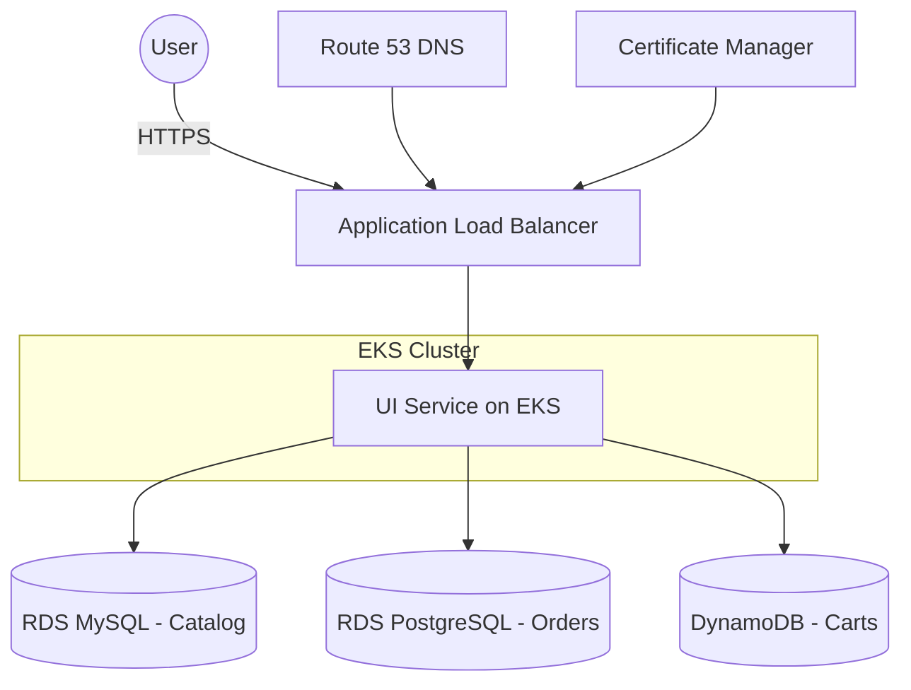

Got it ✅ — here’s a polished `README.md` you can drop straight into your GitHub repo:

````markdown
# 🚀 InnovateMart – Project Bedrock  
**Production-Grade EKS Deployment with Terraform & GitHub Actions**

---

## 🏗️ Architecture Overview  

The solution is built on a foundation of **Infrastructure as Code (Terraform)** and **CI/CD (GitHub Actions)**.  

### Core Infrastructure
- VPC with **public** and **private** subnets.  
- **EKS cluster** deployed in private subnets for security.  
- Worker nodes in an **Auto Scaling Group**.  
- Application deployed via **Kubernetes manifests**.  

### Bonus Objectives – Enhanced Architecture
- **Persistence**  
  - In-cluster DBs replaced with **AWS managed services**:  
    - RDS (PostgreSQL) → Orders  
    - RDS (MySQL) → Catalog  
    - DynamoDB → Carts  
  - Provides durability, scalability, and automated backups.  

- **Networking**  
  - **AWS Application Load Balancer (ALB)** provisioned via Kubernetes Ingress.  
  - Managed by **AWS Load Balancer Controller**.  
  - **TLS termination** with ACM certificate.  
  - Routes **HTTPS traffic** to the `ui` service.  

- **DNS**  
  - **Custom domain** configured in **Route 53** for stable user access.  

---

## 🌐 Accessing the Application  

- The **Terraform CI/CD pipeline** provisions infrastructure automatically when code is merged into `main`.  
- Once deployed, the application UI will be available at the **Route 53 record URL**:  

```text
https://Skillz008.onmicrosoft.com
````

* The output of `terraform apply` provides the final URL.

---

## 👩‍💻 Developer Read-Only Access

Terraform provisions credentials for the IAM user `innovatemart-project-bedrock-developer-ro`:

* **Access Key ID:** `AKIA...`
* **Secret Access Key:** *(output once — must be stored securely)*

### Configuration Steps

1. **Install & configure AWS CLI**

   ```bash
   aws configure
   ```

   Use the Access Key and Secret Key provided.

2. **Update local kubeconfig for EKS access**

   ```bash
   aws eks update-kubeconfig --region us-west-2 --name innovatemart-project-bedrock-cluster
   ```

3. **Verify read-only access**

   ```bash
   kubectl get pods --namespace default   # ✅ Should work
   kubectl delete pod some-pod --namespace default  # ❌ Should fail with "Forbidden"
   ```

---

## 📦 Bonus Implementation Details

* **Managed Services**

  * Terraform modules provisioned **RDS (PostgreSQL/MySQL)** and **DynamoDB**.
  * Database credentials managed via **Terraform variables** (e.g., `TF_VAR_rds_orders_password`).
  * Injected into Kubernetes as **Secrets** — never stored in Git.

* **Networking**

  * AWS Load Balancer Controller installed via **Helm chart** in Terraform.
  * **Ingress resource** defines ALB config and TLS termination.
  * Terraform fetches Route 53 **Zone ID** via data source to create ACM validation and ALIAS records automatically.
  * Ensures a **secure, automated public endpoint**.

---

## ✅ Production-Ready Setup

This architecture demonstrates a **secure, scalable, production-grade EKS deployment** on AWS with:

* Automated provisioning via Terraform CI/CD
* Managed database services
* Secure networking with ALB + ACM
* Custom DNS with Route 53
* Developer read-only cluster access

---

## 📖 Diagram (Architecture Overview)



---

### 📝 Notes

* Save IAM credentials securely — they will not be retrievable again from Terraform.
* Do **not** commit secrets or credentials into version control.
* All provisioning is automated through **Terraform + GitHub Actions**.
